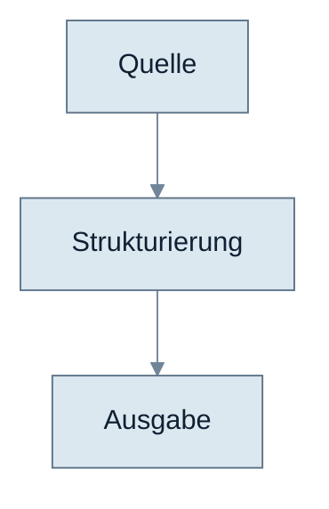

# STD_FORMAT.md

## Zweck

Diese Datei definiert den Standard für Markdown-Dateien in diesem Repository.

Der Fokus liegt auf:

- Projektunterlagen und Zusammenfassungen
- Kollaborations- und Abstimmungsnotizen
- technische Forschungs- und Architekturverdichtungen
- ADRs und weitere Entscheidungsdokumente
- künftige Spezifikationen für Zwischenformat, XML-Mapping und Validierung
- Mermaid-Diagramme

## Sprachstandard

- Schreibe standardmässig in Deutsch.
- Verwende die Du-Form.
- Nutze echte Umlaute: `ä`, `ö`, `ü`.
- Verwende niemals das scharfe s, sondern immer `ss`.
- Verwende im sichtbaren Text nicht `ae`, `oe` oder `ue`, wenn echte Umlaute korrekt sind.
- Halte den Stil sachlich, kompakt und nachvollziehbar.
- Ausnahme:
  Kanonische Fachbegriffe, API-Namen, Dateinamen, Schemas und etablierte Feldnamen dürfen englisch oder ASCII bleiben.

## Dateinamen

- Keine Umlaute in Dateinamen.
- ASCII-only, wenn möglich.
- Bevorzuge stabile, klar lesbare Namen.
- Nutze `kebab-case` oder klar begründete feste Namen.
- Datierte Dateien folgen `yyyy-mm-dd-kurztitel.md`.
- ADRs folgen `adr-001-kurztitel.md`.

Beispiele:

- `2026-03-12-dlh-projekteingabe-ki-xml.md`
- `hosting-zugriff-und-sicherheit.md`
- `adr-001-json-zwischenformat.md`
- `pipeline-overview.md`

## Allgemeiner Dokumentaufbau

Jede inhaltliche Datei soll, wenn passend, diese Ebenen klar trennen:

1. Kontext oder Zweck
2. belastbare Beobachtungen oder Fakten
3. Interpretation oder Verdichtung
4. Entscheidungen oder Empfehlungen
5. offene Punkte

Wenn eine Ebene für die Datei nicht relevant ist, wird sie weggelassen statt künstlich gefüllt.

## Statusmarkierungen im Text

Wenn Sachverhalte leicht verwechselt werden könnten, nutze explizite Marker:

- `Fakt`
- `Zielbild`
- `Annahme`
- `Entscheidung`
- `Offener Punkt`

Diese Marker können als kurze Zwischenüberschrift, Tabelle oder Label im Fliesstext erscheinen.

## Dokumenttypen

### 1. Projektunterlagen

Zweck:

- formale oder eingereichte Dokumente
- Zusammenfassungen offizieller Projektstände
- belastbare Rahmendaten zu Aufwand, Zielen, Partnern und Finanzierung

Regeln:

- nahe an der Primärquelle bleiben
- keine stillschweigende Umdeutung von Absicht in Ist-Zustand
- wichtige Änderungen mit Datum sichtbar machen

### 2. Kollaborationsnotizen

Zweck:

- Arbeitsregeln
- Besprechungsnotizen
- Korrespondenzverdichtung
- operative Absprachen

Empfohlene Struktur:

- Anlass
- Kernaussagen
- nächste Schritte
- offene Punkte

### 3. Forschungsnotizen

Zweck:

- technische Optionen
- Architekturvarianten
- Tooling-Vergleiche
- Sicherheits- und Integrationsfragen

Empfohlene Struktur:

- Fragestellung
- Beobachtungen
- Einordnung
- verdichtete Empfehlung
- offener Klärungsbedarf

### 4. Design- und Architekturentwürfe

Zweck:

- konsolidierte Systementwürfe
- Modul- und Betriebsbilder
- Integrationspfade und Zielarchitekturen vor einer verbindlichen Entscheidung

Empfohlene Struktur:

- Zweck und Status
- Zielbild
- verdichteter Entwurf
- Diagramme
- offene Punkte

Regeln:

- Diese Dokumente stehen zwischen Forschung und Entscheidung.
- Sie dürfen Empfehlungen verdichten, aber keine stillschweigende Verbindlichkeit erzeugen.
- Mermaid-Diagramme sollen in solchen Dokumenten standardmässig direkt inline als Codeblock stehen.
- Obsidian-spezifische Transklusion wie `![[...]]` wird in versionierten Hauptdokumenten nicht verwendet, wenn GitHub dieselben Inhalte rendern soll.

### 5. ADRs

Zweck:

- nachvollziehbare Architektur-, Betriebs- und Formatentscheidungen

Pflichtabschnitte:

- Kontext
- Entscheidung
- Optionen
- Konsequenzen
- Offene Punkte

### 6. Spezifikationen

Zweck:

- normative Beschreibung von Formaten, Regeln und Schnittstellen

Empfohlene Struktur:

- Zweck
- Geltungsbereich
- Eingaben und Ausgaben
- Felddefinitionen oder Regeln
- Validierung
- Beispiele
- offene Punkte

Zusätzliche Leitplanken für dieses Projekt:

- PDF-Layouts dürfen nicht unkritisch als fertige Fachstruktur übernommen werden.
- Seitenumbrüche, Kopfzeilen und Fusszeilen sind vor der fachlichen Interpretation zu prüfen.
- XML-Zielstrukturen sollen wohlgeformt und deterministisch beschrieben sein.
- Struktur, Semantik und Darstellung sind sauber zu trennen.
- Tag- und Feldnamen sollen innerhalb einer Spezifikation konsistent benannt werden.

### 7. Diagrammdateien

Diagrammdateien sind optional.

Wenn ein Diagramm nur zu einem einzelnen Dokument gehört, soll es direkt im Dokument als Mermaid-Codeblock stehen.

Separate Diagrammdateien sind sinnvoll, wenn ein Diagramm:

- mehrfach wiederverwendet wird
- bewusst als eigenständiges Artefakt gepflegt wird
- ausserhalb eines einzelnen Dokuments referenziert oder weiterverarbeitet werden soll

Solche Diagrammdateien sollen standardmässig nur den Mermaid-Block enthalten.

Keine:

- langen Einleitungen
- erklärenden Absätze
- Mischformen aus Notiz und Diagrammdatei

Kurze Ausnahme:

- ein einzelner Kommentar oberhalb des Mermaid-Blocks ist erlaubt, wenn er für Rendern oder Einordnung nötig ist

## Überschriften

- Nutze klare, sprechende Überschriften.
- Keine nummerierten Überschriften als Pflicht.
- Gliedere vom Allgemeinen zum Spezifischen.
- Vermeide Abschnittsüberschriften ohne Informationswert wie `Sonstiges`, wenn sie präziser benannt werden können.

## Tabellen und Listen

- Nutze Tabellen für strukturierte Vergleiche, Felder und Zuordnungen.
- Nutze Listen nur, wenn der Inhalt tatsächlich listenförmig ist.
- Halte Tabellenzellen und Listenpunkte kompakt.
- Verwende keine tief verschachtelten Listen.

## Zitate, Quellen und Bezugnahmen

- Primärquellen sollen klar benannt werden.
- Bei abgeleiteten Aussagen soll die Herkunft nachvollziehbar bleiben.
- Lange Zitatblöcke vermeiden, wenn eine präzise Verdichtung genügt.
- Korrespondenz nicht ungefiltert duplizieren, sondern auf Kernaussagen verdichten.

## Mermaid-Standard

Verwende bevorzugt einen `init`-Block mit neutralem, gut lesbarem Stil:

Farbkonzept:

- Knoten tragen die eigentliche Fläche und bleiben in einem ruhigen, entsättigten Blau-Grau-Bereich.
- Grössere Container oder `subgraph`-Boxen bleiben standardmässig transparent und markieren Struktur primär über Kontur statt über Füllung.
- Linien, Titel und Hintergrundtext liegen in mittleren Slate-Tönen statt in hartem Schwarz, damit sie auf hellem und dunklem Umgebungs-Hintergrund stabiler wirken.
- Kantenlabels und Notizen erhalten eine sehr helle Fläche, damit kurze Texte nicht im Umgebungs-Hintergrund verschwinden.
- Das Ziel ist nicht host-spezifische Farbanpassung, sondern ein neutrales, kontraststabiles Diagramm, das in GitHub und Obsidian in beiden Modi ruhig wirkt.
- Wenn ein Renderer Transparenz in `clusterBkg` nicht sauber übernimmt, ist `#F3F6F9` der bevorzugte Fallback statt einer stark gefärbten Containerfläche.

## Diagramm-Regeln

- Ein Diagramm trägt möglichst genau eine Hauptaussage.
- Bevorzuge kurze Labels und klare Kantenbeschriftungen.
- Nutze `flowchart` für Abläufe und Systemkontexte.
- Nutze `sequenceDiagram` nur, wenn zeitliche Interaktion entscheidend ist.
- Nutze `classDiagram` oder `erDiagram` nur für echte Modellierungsfragen.
- Halte Farben zurückhaltend und funktional.
- Bevorzuge eine einzige ruhige Farbfamilie statt mehrere Akzentfarben ohne fachliche Bedeutung.
- Verwende Flächen vor allem für eigentliche Knoten; Container und Zonen sollen standardmässig über Rahmen statt über starke Hintergründe wirken.
- Bevorzuge `TD` statt sehr breiter `LR`-Layouts, wenn rechts Labels oder Knoten abgeschnitten wirken.
- Verwende für Flowcharts standardmässig `useMaxWidth: true` und nur moderates Padding, damit der Diagramm-Container nicht unnötig über die verfügbare Breite hinauswächst.
- Wenn Text innerhalb von Knoten oder `subgraph`-Titeln rechts abgeschnitten wirkt, behandle das zuerst als Label-Rendering-Problem statt als Randproblem.
- Bevorzuge dafür `htmlLabels: true` auf Root-Ebene und vermeide unnötige Font-Overrides im Mermaid-Block.
- Wenn ein Diagramm trotzdem am rechten Rand gequetscht wirkt, reduziere die Breite:
  kürzere Labels, stärkerer Textumbruch oder Aufteilung in zwei Diagramme.
- Stelle Diagramme nach Möglichkeit in mehreren Ebenen dar:
  Nutzergruppen, Rollen, Systemzonen, Container, Betriebsgrenzen oder Verantwortungsbereiche.
- Bevorzuge dafür `subgraph`-Container statt nur einer linearen Kette von Knoten.
- Ein gutes Projektdiagramm zeigt nicht nur Reihenfolge, sondern auch Zugehörigkeit, Grenzen und Schnittstellen.
- Ablaufdiagramme sind nur eine Sicht. Prüfe zusätzlich immer, ob eine strukturierende Sicht über Zonen, Komponenten oder Rollen hilfreicher ist.
- Lange deutsche Komposita und Bindestrich-Begriffe werden in Mermaid oft unschön oder zu knapp gerendert.
- Verwende deshalb in Labels und Knotentexten aktiv kürzere Bezeichnungen oder explizite Zeilenumbrüche mit ` `.
- Fülle Knoten nicht bis an ihre sichtbare Breite aus. Lieber zwei kurze Zeilen als eine lange.
- Auch `subgraph`-Titel sollen kurz bleiben. Wenn nötig, lieber einen präzisen kurzen Container-Namen wählen als eine lange Überschrift.
- Diagramme sollen nicht künstlich zu schmal gemacht werden. Container dürfen ruhig breiter sein, wenn dadurch Labels und Struktur klarer lesbar werden.
- Bevorzuge Lesbarkeit vor maximaler Verdichtung:
  lieber etwas breitere Container und saubere Zweizeiler als gequetschte Drei- oder Vierzeiler.
- Wenn es hilft, nutze innerhalb von `subgraph`-Containern eine eigene Richtung wie `direction LR`, um Container natürlicher und breiter aufzubauen.

Bevorzugte Diagrammtypen in diesem Projekt:

- End-to-End-Pipeline
- Systemkontext
- Sicherheits- und Datenfluss
- Moodle-Integrationspfad
- Roadmap oder Phasenmodell

## Qualitätsregeln

- Keine Widersprüche zwischen Projektunterlagen, Kollaborationsnotizen, Forschung und Entscheidungen.
- Keine Vermutungen als Fakten.
- Klare Trennung zwischen Beobachtung, Zielbild und Beschluss.
- Vor dem Speichern echte Umlaute und Schweizer Orthographie prüfen.
